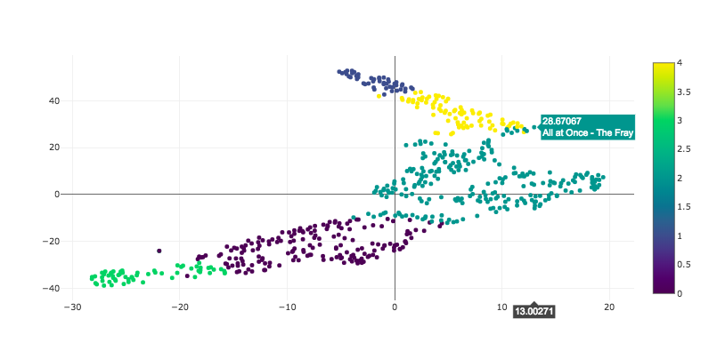

# Spotify Data Science Project

Spotify encodes all songs as a handful of metrics, like 'energy' and 'danceability'. These values are used to suggest new songs to you based on the ones you currently like. Spotify's API makes it easy to download your own library of saved songs and plot these variables. This makes it a perfect environment for practicing data science and machine learning methods, and noticing patterns that are specific to you!


## Requirements

This project relies on Anaconda, which you can download:
	
- For mac: https://conda.io/docs/user-guide/install/macos.html
- For window: https://conda.io/docs/user-guide/install/windows.html
- For linux: https://conda.io/docs/user-guide/install/linux.html
    Be sure to downloard the “Anaconda” version

If you want to use your own data, make sure you have a login for a Spotify account. You will also need to use `pip`, a package manager of Python. Check if you have it installed by going into the Terminal/Command Line and type 
```
pip -V
```
 This will tell you what version of pip, if at all, is on your machine. 

Download `spotipy` by executing in Terminal/Command line:
```
pip3 install spotipy
```

There are a lot of ways to have python installed on your machine, and many of them lead to different problems and different requirements. If your system is not recognizing `spotipy` even after installing it with pip, try `conda install spotipy`.

## Overview

1. [Get set up and collect data.](#Getting-the-Data)
2. [How do we operate on our data?](#Operating-on-DataFrames) What is `pandas`? `numpy`?
3. [Simple visualization](#Visualization)
4. [Supervised learning: Classification and Regression](#Supervised-Learning)
5. [Unsupervised learning: Clustering and Dimensionality Reduction](#Unsupervised-Learning)


## Getting the Data

If you don't have a Spotify account, or are having trouble with this section, you can download `harry.csv` and play with my library! However, if you want to use your own library, follow these instructions:

Go to https://developer.spotify.com/dashboard and make a client. The name doesn't matter, and just click through to indicate you're not going to sell this. Once the client is made, click "Edit Settings" in the top right, and add a new Redirect URI: https://www.spotify.com

For this project, we recommend working in a Jupyter notebook. In order to do this, navigate to a folder you want to do work in and type 
```
jupyter notebook
```

This should open up a browser window for you to work in. If it's not working, you need to install Anaconda. Look through the [Requirements](#Requirements) section. 

Hit New > Notebook > Python 3 to open a new file to work in. You can type all of your code into the cells you see and run by hitting Shift+Enter or hitting the "Run" key. 

Let's start by importing what we need (and making sure all the imports work)

```
import sys
import spotipy
import spotipy.util as util
import pandas as pd
```

Now we need to get an access token to authenticate ourselves with Spotify (so they'll give us data about ourselves).  

Go to developer.spotify.com/dashboard and create a new client. You should see a client_id and client_secret section. Now we get our token into our program:

```
scope = 'user-library-read'
username = 'redacted'
cid = 'redacted'
csecret = 'redacted'
ruri = 'https://www.spotify.com'
token = util.prompt_for_user_token(username, scope, client_id=cid,client_secret=csecret,redirect_uri=ruri)
```

The username doesn't really matter, but the client id and client secret should be copied from your client. Running this will redirect you to Spotify's homepage. It will also prompt you to log in! This will be the account whose library you will have access to. After you've logged in, look in the url and you'll see that your access token is written there! Copy the entire url back into jupyter, and you'll have your token. Let's check it with

```
token
```

Now we're ready to make requests against the API. Let's try

```
sp = spotipy.Spotify(auth=token)
results = sp.current_user_saved_tracks(limit=50)
```

`results` holds the data of the first 50 songs in your library. We need to parse it.

```
artists = []
songs = []
ids = []

for item in results['items']:
    track = item['track']
    ids.append(track['id'])
    songs.append(track['name'])
    artists.append(track['artists'][0]['name'])
```

To get audio features, we call the following function. We also put it into a pandas dataframe, a handy object that will help us play with our data later

```
df = pd.DataFrame(sp.audio_features(ids))
```

We can only request 50 items at a time. If we want to iterate through, we have to do something more complex

```
offset = 50
results = sp.current_user_saved_tracks(limit=50,offset=50)

while(len(results['items']) > 0):
    ids = []
    for item in results['items']:
        track = item['track']
        ids.append(track['id'])
        songs.append(track['name'])
        artists.append(track['artists'][0]['name'])
    df = df.append(pd.DataFrame(sp.audio_features(ids)), ignore_index=True)
    offset = offset + 50
    results = sp.current_user_saved_tracks(limit=50,offset=offset)
```
Finally, we select the columns we want, and add on the song names and artist names. 

```
library = df[['acousticness', 'danceability', 'energy','instrumentalness','key','liveness','loudness','mode','speechiness','tempo','valence']].copy()
library['song_title'] = songs
library['artist'] = artists
```

To see what the dataframe looks like, try
```
library.head()
```

If you want to share your data, write it to a csv file with

```
library.to_csv("filename.csv", index=None)
```


## Operating on DataFrames

In this section, we will play with the package called `pandas`, which is the primary package for data clearning, wrangling and analysis in Python. We will introduce the concept of _DataFrame_ and _Series_ and cover the basic commands, ways to do indexing, some operations on different columns, and how to combine dataframes. Open `02-data-cleaning-and-wrangling` to get started!  

We will start by importing the necessary packages:
```
import pandas as pd
import numpy as np
%matplotlib inline
```

`pandas` is the package used for handling datasets and  `numpy` is used for numeric and matrix operations. `%matplotlib inline` is there so that the plots are rendered directly below each cell.

Then, we will start by loading in `harry.csv` by calling:

```
df = pd.read_csv('<file_name>.csv')
```

This should read in the `.csv` file into the object called `df`. We try print out the type of `df` by calling `type(df)`. You will see that it is of type `pandas.core.frame.DataFrame`. Now there are a lot of very basic, but useful commands you could call on this `df` object. Explore each of the following commands in __separate__ cells:

```
# Print all column names
df.columns
# Or
list(df)

# Print head/tail 5 rows of df
df.head() # Or df.tail()

# Print df info
df.info()

# Print shape (dimensions) of df 
df.shape

# Print data types of each column
df.dtypes

# Print summary stats of df's numeric columns
df.describe()

# Print correlations in between numeric columns in df
df.corr()
```

Explore the output of each command and see what they do! In the following, we move on to talk about indexing using `pandas`. Indexing basically means "selecting" :^) . Again, execute each of the commands below in __separate__ cells:

```
# Selecting one column: 'acousticness'
df['acousticness'] # This might be too long, to just print out the first 5 by 'df['acousticness'][:5]'

# Print out the type of this column:
type(df['acousticness'])

# Index both: 'acousticness', 'danceability'
df[['acousticness', 'danceability']]

# Indexing the first row using .loc
df.loc[0, :]

# Indexing using a logic: acousticness > 0.95
df[df['acousticness'] > 0.95]

# Indexing using combos of logic: acousticness > 0.95 && mode == 0
df[(df['acousticness'] > 0.95) & (df['mode']== 1)]
```

Now we have explored the commands for indexing, let's move on to talk about commands on the columns, such as how to extract information from existing columns and how to create new columns:

```
# Create a new column called "acousticness_2" that is 2 * values in acousticness
df['acousticness_2'] = df['acousticness'] * 2
df.head()

# Print the unique 'key', number of unique artists
df['key'].unique() # Also try df['key'].nunique()

# The value counts for 'key'
df['key'].value_counts()

# Percentage of artists
df['key'].unique()/len(df)

# Quick histogram of 'acousticness'
df['acousticness'].hist()

# Groupby 'key', agg fuctions
df.groupby('key').agg(['mean', 'median']) # Also try 'count', 'sum', ...

# Crosstabs on 'key' and 'mode'
pd.crosstab(df['key'], df['mode'])
```

These are all useful commands you may use in your Data Science journey onwards! Finally, we will look at how to concatenate and merge DataFrames:

```
# Read in YOUR data set
me = pd.read_csv('me.csv')

# Set a 'label' column for each dataframe
df['label'] = 0
me['label'] = 1

# Append/cancat two datasets!
append = df.append(me)
append.shape
``` 

This concludes section 2!

## Visualization

In this section, we will talk about the packages `matplotlib` and `seaborn`, both used for data visualization in Python. We will cover a range of plots that display different aspects of the dataset. We will also learn how to adjust aesthetics, axis labels and legends, and how to output your plot. Open `03-simple-visualizations` to get started! 

Again, we start by importing the necessary packages and loading in the data set:
```
# Import pandas, matplotlib.pyplot, seaborn, set matplotlib inline
import pandas as pd
import numpy as np
import matplotlib.pyplot as plt
import seaborn as sns
%matplotlib inline
```

```
# Load in the data set from harry and you!
ha = pd.read_csv('harry.csv')
me = pd.read_csv('me.csv')
```

We will first look at the more basic (and flexible) package called `matplotlib`. Below, we will explore a number of useful graphs:
```
# Histogram of 'acousticness' in harry.csv
plt.hist(ha['acousticness'])

# Add x, y-axis, title
plt.hist(ha['acousticness'])
plt.xlabel('acousticness')
plt.ylabel('Frequency')
plt.title('Distribution of Acousticness')

# Scatter plot between 'energy', 'loudness'
plt.scatter(ha['energy'], ha['loudness'])

# Change color of points and the markers
plt.scatter(ha['energy'], ha['loudness'], c = 'r', marker = '+') # Explore c = 'b', 'g', 'k'..., and marker = '*', ',', 'v', '2'...

# Add labels and display labels using legend
plt.scatter(ha['energy'], ha['loudness'], c = 'r', marker = '+', label = 'harry')
plt.scatter(me['energy'], me['loudness'], c = 'g', marker = '2', label = 'me')
plt.legend()

# Save a plot to disk
plt.scatter(ha['energy'], ha['loudness'], c = 'r', marker = '+', label = 'harry')
plt.scatter(me['energy'], me['loudness'], c = 'g', marker = '2', label = 'me')
plt.legend()
plt.savefig('plots/cool_plot', fmt = 'png', dpi = 300)
```

This is already pretty cool, but we have something coolER - `seaborn`. `seaborn` is a package built on top of `matplotlib` and it incorporates amazing functionalities. Let's get started:

```
# Plot distribution of 'acousticness'
sns.distplot(ha['acousticness'])

# jointplot: fancy joint-distributions for 'energy', 'loudness', explore kind = 'kde'
sns.jointplot(data = ha, x = 'energy', y = 'loudness', kind = 'kde')

# countplot: count number of occurrences for each 'key', explore using x = 'key' and y = 'key'
sns.countplot(data = ha, x = 'key')

# barplot: plot averge 'energy' per 'key'
sns.barplot(data = ha, x = 'key', y = 'energy')

# swarmplot: for 'key' and 'energy', explore hue = 'mode'
sns.swarmplot(data = ha, x = 'key', y = 'energy')

# pairplot: scatter plot for multiple columns at the same time
# use: 'acousticness', 'loudness', 'energy', 'key', explore hue = 'key'
sns.pairplot(ha[['acousticness', 'loudness', 'energy', 'key']])

# regplot: 'energy' and 'loudness'
sns.regplot(data = ha, x = 'energy', y = 'loudness')
```

## Supervised Learning

In this section, we will talk about supervised learning - classification and regression. We will use the package `sklearn` to train machine learning models and understand the basic machine learning pipeline. We will explore:
1. Classification - using Decision Trees to predict if a song comes from your library or Harry's
2. Regression - using linear regression to predict loudness of the songs  

We will also cover ways to perform model assessment through techniques like train-test-split and confusion matrix. Open `04-regression-and-classification` to get started!

Again, we start by loading in the packages of the dataframes:
```
import pandas as pd
import seaborn as sns
import numpy as np
import matplotlib.pyplot as plt
import sklearn
from sklearn.metrics import confusion_matrix, mean_squared_error
from sklearn import tree, linear_model
from sklearn.model_selection import train_test_split

np.random.seed(4747)
```
```
# Read in the two csvs
h = pd.read_csv('harry.csv')
m = pd.read_csv('me.csv')
```

We will first explore classification - we will predict if a song comes from you or Harry! To do this, recall that we can create artifical labels for each dataframe:
```
# Create the labels
h['label'] = 'harry'
m['label'] = 'me'

# Merge the two datasets
df = pd.concat([h,m])

df.shape
```

Then we explore the value counts to see how many come from each dataframe:
```
# Look at value counts of 'label'
df['label'].value_counts()
```

After that, we will define the `predictors`, or the _features_ of our model, and the `target`, or the _label_ we are trying to predict:
```
# Define the predictors (use list comprehension!, not in ['song_title', 'artist', 'label']) and target
predictors = [c for c in list(df) if c not in ['song_title', 'artist', 'label']]
target = 'label'

print(predictors)
```

Now we will extract the actual data used to train the model and the labels that inform training:
```
# Define X_data and y_data as the "values" of df
X_data = df[predictors]
y_data = df[target]
```

Then, we split the dataframe into training set and testing set. This is important because we want to get a sense of how well our model performed:
```
# Define training and testing sets
X_train, X_test, y_train, y_test = train_test_split(X_data,
                                                    y_data,
                                                    test_size = 0.25, # how much to put to test set
                                                    random_state = 47) # this makes the split reproducible
```

Now it's the exciting part - we will train a Decision Tree to classify the songs! We will also play around with the idea of a _tuning parameter_, which defines the model complexity. We will talk more about this in the workshop:
```
# One tuning parameter
max_depth = 5

# Define clf
clf = tree.DecisionTreeClassifier(max_depth = max_depth)

# Fit classifier
clf.fit(X_train, y_train)
```

The Decision Tree algorithm utilitzes a binary tree structure and goes through all possible cutting points within each feature to greedily splits the data set into homogeneous regions with regard to the _target_, i.e. it's trying to find purer and purer nodes in terms of percentage of each class. Because splits happens on the features, some features are more important than others. And the `sklearn` package gives us the _feature importance_ for free!!
```
# Look at feature importance
{c:str(round(v,4)) for c,v in zip(predictors, clf.feature_importances_)}
```

We notice that `instrumentalness` seems to be really important. Let's verify that through a barplot:
```
# Let's take a look!
sns.barplot(data = df, x = 'label', y = 'instrumentalness')
```
 
At the end of the day, we use machine learning model to inform future decisions. So now it's the time to do predictions!
```
# Prediction!
preds = clf.predict(X_test)
print("Accuracy is:", sum(a == b for a,b in zip(preds, y_test))/len(preds)) # Accuracy is: 0.75142
```

Not too bad! Let's also take a look at the _confusion matrix_, which is an important tool used to look at false positive and false negatives (not in this case, but...):
```
# Look at the confusion matrix (test, pred)
conf_mat = confusion_matrix(y_test, preds)
sns.heatmap(conf_mat, annot = True, fmt='g')
plt.ylabel('True label')
plt.xlabel('Predicted label')
```

You can also normalize the confusion matrix by the actual labels or the predicted labels:
```
# Normalized conf_mat
conf_mat = conf_mat / conf_mat.sum(axis=1)[:, np.newaxis]
conf_mat

sns.heatmap(conf_mat, annot = True)
plt.ylabel('True label')
plt.xlabel('Predicted label')
```


Okay, enough of the classification stuff. Now let's move on to regression - we will predict the `loudness` based on other features we have! We start by defining the predictors and target, extract the values, define train and test sets:
```
# Define the predictors and target
predictors = [c for c in list(df) if c not in ['song_title', 'artist', 'loudness', 'label']]
target = 'loudness'

print(predictors)
# Define X_data and y_data
X_data = df[predictors]
y_data = df[target]

# Define training and testing sets
X_train, X_test, y_train, y_test = train_test_split(X_data,
                                                    y_data,
                                                    test_size = 0.25,
                                                    random_state = 47)
```

We will fit a linear regression model - sorry if it's that that exciting :( - and make the predictions:
```
# Create linear regression object
regr = linear_model.LinearRegression()

# Train the model using the training sets
regr.fit(X_train, y_train)

# Make predictions using the testing set
preds = regr.predict(X_test)
```

A useful metric to gauge the performance of regression model is called `Mean Squared Error`, which is defined by:
$$MSE = \frac{1}{n}\sum_{i=1}^{n} (\hat{y_i} - y_i)^2$$

Take a look at our performance and think about what that means:
```
# Look at MSE
print("Mean squared error: %.2f"
      % mean_squared_error(y_test, preds))
```

We can also plot the predicted values against the actual values:
```
# Plot predicted against actual
plt.scatter(preds, y_test)
plt.xlabel('Predictions')
plt.ylabel('Labels')
plt.xlim(-35, 0)
plt.xlim(-35, 0)
```
Note that it's important to rescale the x and y axis to not give you a fake illusion. Alternatively, we can also look at the distribution of residuals (or the difference between the predictions and the actual labels):
```
# Look at residuals
sns.distplot(y_test - preds)
```


## Unsupervised Learning

Let's return to our original dataset

```
library = pd.read_csv('<file_name>.csv')
```

Unsupervised learning is the process of trying to learn from data that has not been labeled yet. For example, you might think the songs you like fall under a few "groups," but you don't know what those groups are. This is a problem called clustering, where we try to separate our data into unlabeled groups based on which points are close to each other. 

We also want to be able to visualize our data. It's hard to think in 11 dimensions, (at least for me) so we'll try a technique called dimensionality reduction. We're trying to plot our points in 2 dimensions so that points that are close to each other in the 11-dimensional space are close to each other here, and faraway points stay faraway. A popular dimensionality reduction algorithm from the `scikit-learn` package is called `t-SNE`. We can run it:

```
from sklearn.manifold import TSNE
X = library.drop(['song_title','artist'], axis=1).values
model = TSNE(random_state=0)
fit = pd.DataFrame(model.fit_transform(X))
```

The `random_state` variable just sets the seed, so it will behave the same way every time. Now each point as an x- and y-coordinate for its mapping in 2-dimensional space. We want to add that to our DataFrame:
```
library['TSNE-X'] = fit[0]
library['TSNE-Y'] = fit[1]
```

And we can plot it:

```
from matplotlib.pylab import scatter
x = library['TSNE-X']
y = library['TSNE-Y']
scatter(x, y,c='black',s=5)
```

If we want to make sense of what we see, we might want to know what part of the plot contains the danceable songs. To do that, we can use `pyplot.colorbar`:

```
from matplotlib.pyplot import colorbar
c = library['danceability']
p = scatter(x, y,c=c,s=5)
colorbar(p)
```

Now let's try clustering. One of the simplest clustering algorithms is called `k-Means`. To run it, you have to specify `k`, the number of clusters you want to separate the data into. This is an important decision, so think carefully! Then run

```
from sklearn.cluster import KMeans
kmeans = KMeans(n_clusters=5, random_state=0).fit_predict(X)
```

Let's add it to our DataFrame:
```
library['cluster'] = kmeans
```

Let's see where those clusters are in the 2-dimensional embedding:

```
c=library['cluster']
p= scatter(x, y,c=c,s=5)
colorbar(p)
```

If you want to see what is really different about these groups, we can look at their average attribute values with 

```
library.groupby(['cluster']).mean()
```

If you want to know even more about this plot, like what song is represented by each data point, I recommend using `plotly`, a package that allows for interactive plots in a notebook file. Run `pip3 install plotly` or `conda install plotly` in your terminal. Then import what you need:

```
from plotly.offline import init_notebook_mode, iplot
import plotly.graph_objs as go
```

Then you have to initialize your notebook as an interactive environment for the plots:
```
init_notebook_mode(connected=True)
```

And now you're ready to plot! Try

```
trace = go.Scatter(
    x = library['TSNE-X'],
    y = library['TSNE-Y'],
    mode = 'markers',
    text = library['song_title'] + " - " + library['artist'],
    marker=dict(
        color = library['cluster'], #set color equal to a variable
        colorscale='Viridis',
        showscale=True
    )
)
data = [trace]
iplot(data)
```



## Conclusion

Now you're ready to play with your data and see what you can find. Best of all, whatever you find is specific to you! Here are some fun and/or useful links to better understand the data:

- [Spotify API documentation for what the audio features are](https://developer.spotify.com/documentation/web-api/reference/tracks/get-audio-features/)
- [Data Science article discussing why pop music all sounds the same](https://pudding.cool/2018/05/similarity/)

